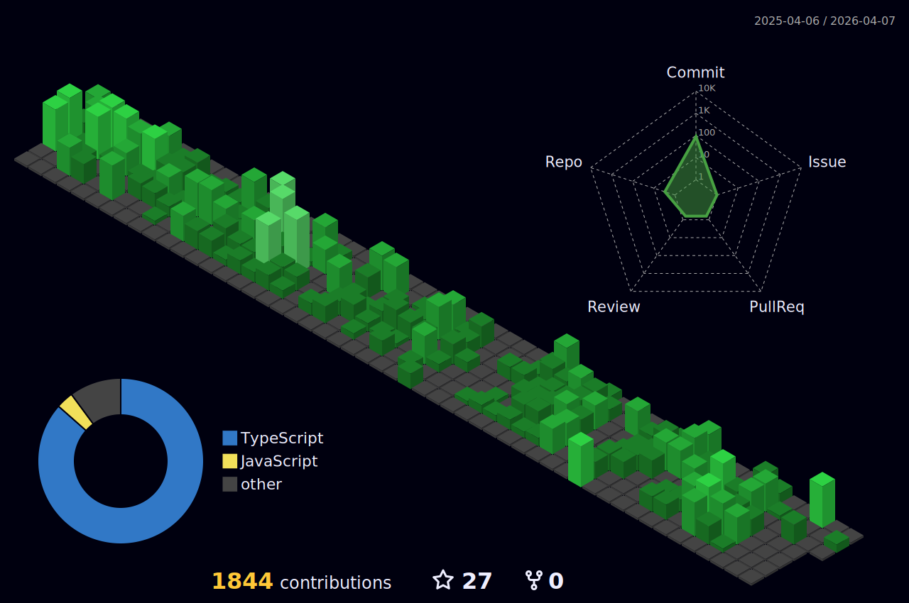

<h1 align="left">Hey 👋 What's up?</h1>

###

My name is Caio Lucena Colaço and I'm a Dev, from Fortaleza - CE, Brazil

###

<h2 align="left">About me</h2>

###

✨ Creating bugs since 2020 📚 I'm currently learning Web development and automation using python 🎯 Goals: Always overcome the next challenge 🎲 Fun fact: I love home office

###

     

###

<h2 align="left">I code with</h2>

###

###

<h2 align="left">Come talk to me</h2>

###

  <a href="https://www.linkedin.com/in/caiolucenacolaco/" target="_blank"><a/>
  <a href="https://www.instagram.com/caio_colaco/" target="_blank"><a/>

###
